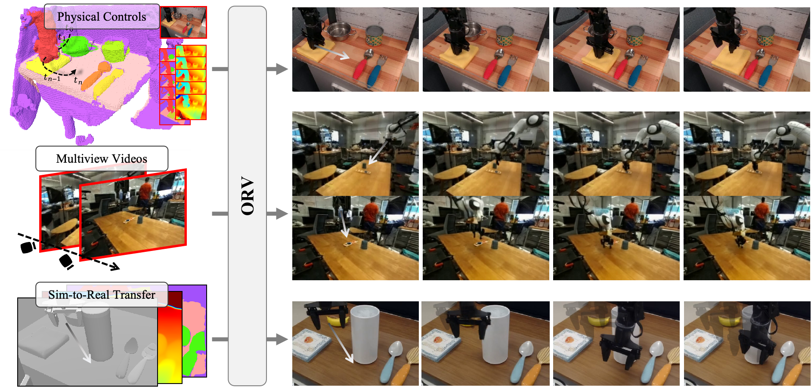

# ORV: 4D Occupancy-centric Robot Video Generation

TL;DR ORV generates robot videos with the geometry guidance of 4D occupancy, achieves higher control precision, shows strong generalizations, performs multiview consistent videos generation and conducts simulation-to-real visual transfer.



> [**ORV: 4D Occupancy-centric Robot Video Generation**](https://orangesodahub.github.io/ORV/)                
> Xiuyu Yang*, Bohan Li*, Shaocong Xu, Nan Wang, Chongjie Ye, Zhaoxi Chen, Minghan Qin, Yikang Ding, Zheng Zhu, Xin Jin, Hang Zhao, Hao Zhao                                     
> *Preprint ([arXiv 2506.03079](https://arxiv.org/abs/2506.03079))*

## BibTeX
If you find our work useful in your research, please consider citing our paper:
```bibtex
@article{yang2025orv,
    title={ORV: 4D Occupancy-centric Robot Video Generation},
    author={Yang, Xiuyu and Li, Bohan and Xu, Shaocong and Wang, Nan and Ye, Chongjie and Chen Zhaoxi and Qin, Minghan and Ding Yikang and Jin, Xin and Zhao, Hang and Zhao, Hao},
    journal={arXiv preprint arXiv:2506.03079},
    year={2025}
}
```


## Environment Setup
Clone the ORV repository first:

```bash
git --recurse-submodules clone https://github.com/OrangeSodahub/ORV.git
cd ORV/
```

Create new python environment:

```bash
conda create -n orv python=3.10
conda create orv

pip install -r requirements.txt
```

Note that we use `cuda11.8` by default, please modify the lines in `requirements.txt` shown below to support your own versions:

```text
torch==2.5.1 --index-url https://download.pytorch.org/whl/cu118
torchaudio==2.5.1 --index-url https://download.pytorch.org/whl/cu118
torchvision==0.20.1 --index-url https://download.pytorch.org/whl/cu118
```

Our checkpoints are host at [huggingface repo](https://huggingface.co/gzzyyxy/orv-gen-model/tree/main), feel free to download them.

## Data Preparation

#### 1. (Singleview) Video-Trajectory Data

For BridgeV2 and RT-1 data (singleview), we primarily reuse the video-trajectory data from [IRASim](https://github.com/bytedance/IRASim) (originally from OXE version). We also put the download links below for convenience:

|Data | Train | Evaluation |
|:--: |:-----:|:----------:|
|BridgeV2|[bridge_train_data](https://lf-robot-opensource.bytetos.com/obj/lab-robot-public/opensource_IRASim_v1/rt1_train_data.tar.gz)|[bridge_eval_data](https://lf-robot-opensource.bytetos.com/obj/lab-robot-public/opensource_IRASim_v1/bridge_evaluation_data.tar.gz)|
|RT-1|[rt1_train_data](https://lf-robot-opensource.bytetos.com/obj/lab-robot-public/opensource_IRASim_v1/rt1_train_data.tar.gz)|[rt1_eval_data](https://lf-robot-opensource.bytetos.com/obj/lab-robot-public/opensource_IRASim_v1/rt1_evaluation_data.tar.gz)|

> This versions of data have raw resolutions of `480×640` for BridgeV2, and `256×320` for RT-1, and we train ORV models on preprocessed `320×480` resolution (Please refer to Section E.3 in paper for the details).

#### 2. (Multiview) Video-Trajectory Data

Please download the official BridgeV2 data (all episodes have 1~3 views) from [official BridgeV2 tfds](https://rail.eecs.berkeley.edu/datasets/bridge_release/data/tfds/bridge_dataset/1.0.0/) and then extract the usable bridge data:

```bash
bash scripts/extract_data_tfds.sh bridge
```

We follow the [official Droid tutorials](https://droid-dataset.github.io/droid/the-droid-dataset.html) to download DROID dataset (all episodes have 2 views) in RLDS and then extract:

```bash
# download raw tfds data (~1.7TB)
gsutil -m cp -r gs://gresearch/robotics/droid <path_to_your_target_dir>

# extract
bash scripts/extract_data_tfds.sh droid
```

> This versions of data have raw resolutions of `256×256` for BridgeV2 and `180×256` for Droid, and we train ORV models on `320×480` for BridgeV2 and `256×384` for Droid.

#### 2. Occupancy Data

To be finished.

#### 3. Encode to (VAE) latents

Training or evaluation with processed latents data instead of encoding videos or images online will dramaticallly save memory and time. We use the VAE loaded from huggingface `THUDM/CogVideoX-2b`. 

Please refer to [scripts/encode_dataset.sh](https://github.com/OrangeSodahub/ORV/tree/main/scripts/encode_dataset.sh) and [scripts/encode_dataset_dist.sh](https://github.com/OrangeSodahub/ORV/tree/main/scripts/encode_dataset.sh) to encode images or videos to latents and save them to disk. Please first check the arguments in scripts first (`--dataset`, `--data_root` and `--output_dir`) and then run:

```bash
# single process
bash scripts/encode_dataset.sh $SPLIT $BATCH

# multiple processes
bash scripts/encode_dataset_dist.sh $GPU $SPLIT $BATCH
```

where `SPLIT` is one of 'train', 'val', 'test', `$GPU` is the number of devices, `$BATCH` is the batch size of dataloader (recommend just use 1).

> For those data reused from IRASim, please ignore their processed latents data and only raw `.mp4` data will be used.

## Training

#### Stage1 Singleview Action-to-video Generation

We first get the basic singleview action-to-video generation model starting from the pretrained [THUDM/CogVideoX-2b](https://huggingface.co/zai-org/CogVideoX-2b) (Text-to-video) model through SFT. Please check out and run the following script:

```bash
bash scripts/train_control_traj-image_finetune_2b.sh --dataset_type $DATASET
```

where `$DATASET` is chosen from ['bridgev2', 'rt1', 'droid'].

> #### Use the correct configurations:
> 1. CUDA devices: please set correct value for the key `ACCELERATE_CONFIG_FILE` in these `.sh` scripts which are used for accelerate launching. Predfined `.yaml` files are at [config/accelerate](https://github.com/OrangeSodahub/ORV/tree/main/config/accelerate/);
> 2. Experimental settings: Each configuration in [config/traj_image_*.yaml](https://github.com/OrangeSodahub/ORV/tree/main/config/) files corresponds to one training experimental setting and one model. Please set the correct value for the key `EXP_CONFIG_PATH` in scripts.

#### Stage2 Occupancy-conditioned Generation

We incorporate occupancy-derived conditions to have more accurate controls. First set the correct path to pretrained model at stage1 in `config/traj_image_condfull_2b_finetune.yaml`:

```yaml
transformer:
  <<: *runtime
  pretrained_model_name_or_path: THUDM/CogVideoX-2b
  transformer_model_name_or_path: outputs/orv_bridge_traj-image_480-320_finetune_2b_30k/checkpoint
```

Then run the following script (the yaml config file above is set in this script):

```bash
bash scripts/train_control_traj-image-cond_finetune.sh
```

#### Stage3 Multiview Generation

This step further extends the singleview generation model to multiview generation model. First set the correct path to pretrained singleview model in `config/traj_image_2b_multiview.yaml` and then run the following script:

```bash
bash scripts/train_control_traj-image-multiview.sh
```

Note that all RGB and condition data of all views need to be processed to latents first.

## Evaluation and Metrics

#### 1. Inference on dataset

Generally, run the following script to inference the trained model on the specific dataset:

```bash
# single process
bash scripts/eval_control_to_video.sh

# multiple processes
bash scripts/eval_control_to_video_dist.sh $GPU
```

Please choose the correct `*.yaml` configuration file in scripts:

- `eval_traj_image_2b_finetune.yaml`: base action-to-video model
- `eval_traj_image_cond_2b_finetune.yaml`: singleview occupancy-conditioned model
- `eval_traj_image_condfull_2b_multiview.yaml`: multiview occupancy-conditioned model

#### 2. Metrics Calculation

Set the keys `GT_PATH` and `PRED_PATH` in following script and run it to calculate metrics (refer to Section E.4 in paper for more details):

```bash
bash scripts/eval_metrics.sh
```

## Inference on Demo Data

To be finished.

## TODO

- [x] Release arXiv technique report
- [x] Release full codes
- [x] Release checkpoints
- [ ] Finish the full instructions
- [ ] Release processed data


## Acknowledgement

Thansk for these excellent opensource works and models: [CogVideoX](https://github.com/THUDM/CogVideo); [diffusers](https://github.com/huggingface/diffusers);.
